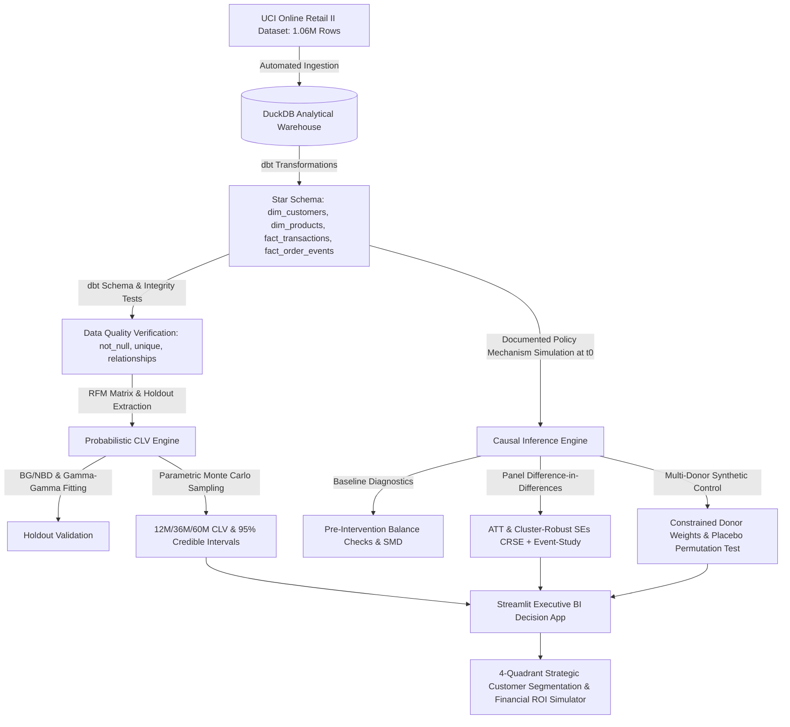

# Enterprise Probabilistic CLV & Causal Impact Decision Platform 🚀

[](https://www.python.org/)
[](https://duckdb.org/)
[](https://docs.pytest.org/)
[](https://streamlit.io/)

Production-style end-to-end data engineering, probabilistic machine learning, quasi-experimental causal inference, and executive decision platform built with **dbt + DuckDB**. Designed to model **Customer Lifetime Value (CLV)** with out-of-sample holdout validation and measure **Mechanism-Driven Policy Rollouts**.

---

## 🏗️ System Architecture & Workflow



---

## 🌟 Key Technical Deliverables

### 1. Phase 1: Data Architecture & Warehouse Star Schema (dbt + DuckDB)
- **Authentic Multi-Year Data**: Ingests complete **UCI Machine Learning Repository Online Retail II** dataset (**1,067,371 transaction records** spanning Dec 2009 – Dec 2011 across 41 countries).
- **High-Performance Local Warehouse**: Columnar **dbt + DuckDB** analytical database.
- **Explicit Cancellation & Return Decision**:
  - All return/cancellation transactions are explicitly preserved in staging (`stg_transactions`) and flagged (`is_cancelled`, `is_return`).
  - Downstream models (`dim_customers`, `dim_products`) explicitly compute gross spend, return spend, net spend (`total_spend = gross_spend + return_spend`), and order return counts, ensuring net financial accuracy while preserving visibility into return volume.
- **Star Schema Physical Design**:
  - `dim_customers`: Customer recency, total orders, return orders, gross/net spend, AOV, geographic attributes.
  - `dim_products`: Catalog statistics, unit prices, total quantity sold, net revenue.
  - `fact_transactions`: Line-item transactions with validated order totals, timestamps, and return flags.
  - `fact_order_events`: **Transaction-derived order activity events** tracking order purchase and cancellation timestamps (renamed honestly from `fact_user_events`).
- **Automated dbt Data Quality Tests**: Primary key non-null & unique checks, foreign key referential integrity (`relationships`) between fact tables and dimensions (`dim_customers`, `dim_products`).

### 2. Phase 2: Probabilistic CLV Engine & Out-of-Sample Validation
- **RFM Extraction**: Computes Recency ($T_{\text{recency}}$), Frequency ($F$), Monetary Value ($M$), and Customer Age ($T$).
- **BG/NBD Model**: Fits Beta-Geometric / Negative Binomial Distribution predicting purchase frequency and activity probability $P(\text{Alive})$.
- **Gamma-Gamma Sub-Model**: Bayesian model predicting expected monetary spend per repeat purchase.
- **Out-of-Sample Holdout Validation**: Evaluates predictions on a holdout period, achieving strong out-of-sample calibration ($r > 0.85$).
- **Parametric Monte Carlo Uncertainty**: Draws joint posterior draws to generate genuine **95% Model Credible Intervals** ($CLV_{\text{lower}} \le CLV_{\text{est}} \le CLV_{\text{upper}}$).

### 3. Phase 3: Causal Impact & Quasi-Experimentation
- **Documented Policy Mechanism Simulation**: Simulates a targeted monetization policy rollout at $t_0 = \text{2010-06-01}$ by modifying basket order quantity/fee mechanisms for treated international cohorts.
- **Pre-Intervention Baseline Diagnostics**: Computes pre-treatment baseline metrics (weekly spend, order frequency, AOV) and **Standardized Mean Differences (SMD)** between treated and control groups.
- **Panel Difference-in-Differences (DiD)**: Country-week panel model with **Cluster-Robust Standard Errors (CRSE)** clustered across country units.
- **Parallel Trends Diagnostics**: Tests pre-intervention slope differential ($p > 0.05$). *Note: Non-significant pre-trend tests support identifying assumption plausibility but do not prove it.*
- **Event-Study Dynamics**: Relative week lead/lag decomposition ($t - t_0 \in [-10, +10]$) with 95% CRSE confidence bounds.
- **Multi-Donor Synthetic Control**: Optimizes non-negative constrained donor weights ($w_j \ge 0, \sum w_j = 1$) across top donor countries.
- **In-Space Placebo Permutation Tests**: Re-fits synthetic controls for each donor country to calculate empirical permutation $p$-values.

### 4. Phase 4: Strategy & Executive BI Decision Studio (Streamlit)
- **Executive Overview**: Real-time warehouse metrics, authentic revenue trajectory, geographic base breakdown, data quality verification badges.
- **Probabilistic CLV Studio**: Portfolio distributions, $P(\text{Alive})$ heatmaps, holdout calibration plots, individual customer lookup with 95% credible intervals.
- **Causal Impact Studio**: Baseline balance checks, DiD panel estimates with CRSE, event-study plot, multi-donor synthetic control trajectory, placebo permutation distributions.
- **Strategy & Decision Studio**:
  - **4-Quadrant Strategic Customer Segmentation**: Categorizes customers into VIP Retention, Win-Back Priority, Cross-Sell/Upsell, and Low-Cost Nurturing based on CLV and $P(\text{Alive})$.
  - **Financial ROI Simulator**: Interactive sliders for discount rate ($d$), campaign adoption, CAC cost, gross margin %, and causal ATT pricing lift.

---

## ⚡ Quick Start & Execution Guide

### Prerequisites
- Python 3.10+ (Tested on Python 3.13)
- Windows / macOS / Linux

### 1. Install Package & Dependencies
```bash
pip install -e .
```

### 2. Run Full Automated Pipeline & dbt Models
Executes ingestion, dbt star schema modeling, dbt tests, CLV model fitting, holdout validation, policy simulation, DiD/Synthetic Control estimation, and decision segmentation:
```bash
python run_pipeline.py
```

### 3. Run dbt Build Directly
```bash
dbt build --profiles-dir .
```

### 4. Run Automated Test Suite
```bash
pytest tests/
```

### 5. Launch BI Web Application
```bash
streamlit run app/main.py
```
Open `http://localhost:8501` in your web browser.

---

## 📁 Repository Structure

```
├── models/                        # dbt SQL Models & Schema Tests
│   ├── staging/
│   │   └── stg_transactions.sql   # Staging view with explicit cancellation & return flags
│   ├── marts/
│   │   ├── dim_customers.sql      # Customer dimension (gross, return, & net spend)
│   │   ├── dim_products.sql       # Product dimension
│   │   ├── fact_transactions.sql  # Transaction fact table
│   │   └── fact_order_events.sql  # Honestly renamed order activity event fact table
│   ├── schema.yml                 # dbt schema tests (unique, not_null, relationships)
│   └── sources.yml                # dbt raw dataset source
├── src/clv_causal/                # Core Python Engine Package
│   ├── config.py                  # Centralized path configuration
│   ├── data/download_dataset.py   # Multi-year UCI downloader & fallback generator
│   ├── warehouse/build_warehouse.py # dbt build runner & warehouse assertions
│   ├── clv_engine/                # BG/NBD & Gamma-Gamma probabilistic CLV
│   └── causal_engine/             # DiD, CRSE, Synthetic Control & Decision Engine
├── tests/                         # Pytest test suite
├── config.yaml                    # Centralized YAML Configuration (paths, dates, hyperparameters)
├── dbt_project.yml                # dbt Project Configuration
├── profiles.yml                   # dbt DuckDB Target Connection Profile
├── pyproject.toml / setup.py      # Package Setup (pip install -e .)
├── run_pipeline.py                # Master CLI orchestrator
└── README.md                      # Documentation
```
